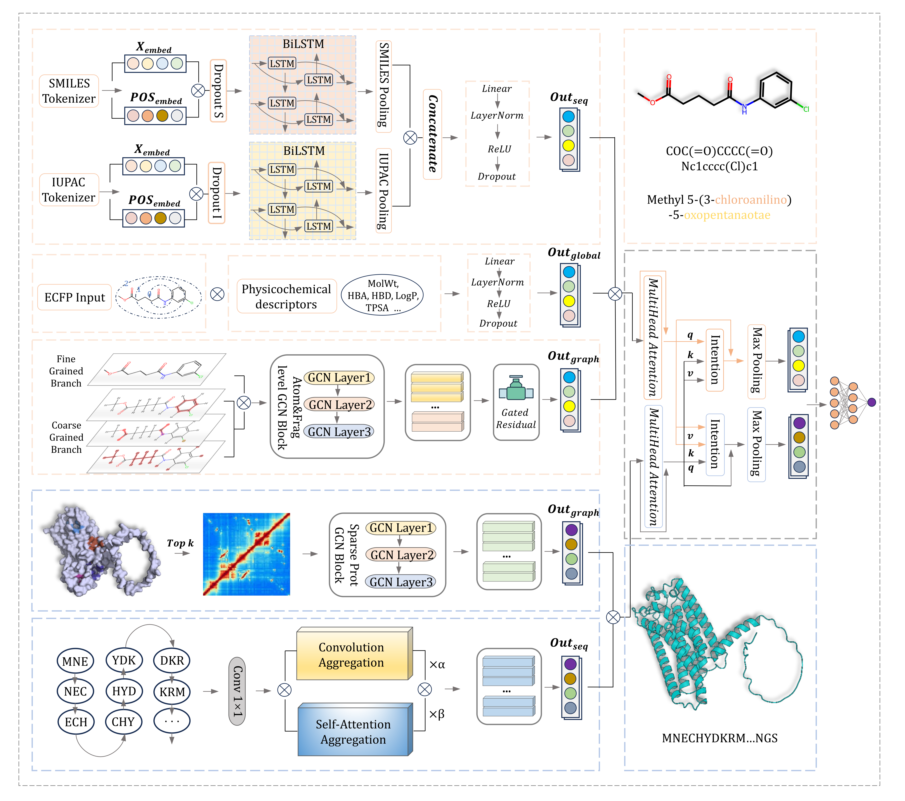

# UniDTI
A Multi-modal and Multi-scale Unified Deep Learning Framework for Drug-Target Interaction Prediction

## 🏗️ Framework
<p align="center">
  
</p>

## 🛠️ Installation
1. Create the Conda environment:
   ```bash
   conda env create -f environment.yaml
2. Activate the environment:
   ```bash
   conda activate unidti
   
## 🏋️ Training

## 🔍 Inference

## 📁 Repository Structure
```
UniDTI/
├── Figure/ # Figures and visualizations used in the UniDTI
├── datasets/ # Raw and preprocessed datasets
├── models/ # Saved model checkpoints
├── notebook/ # Jupyter notebooks for coarse-grained feature extraction
├── output/ # Output files
├── prot-gnn-data/ # Protein graph data for GNN-based modeling
├── src/ # Source code for feature extraction, training and inference 
├── README.md # Project documentation
└── environment.yaml # Conda environment configuration of UniDTI
```
Note: Our code is mainly referenced from [EFGs](https://github.com/rdkit/rdkit/tree/master/Contrib/efgs) and [BINDTI](https://github.com/plhhnu/BINDTI).
We gratefully acknowledge the authors for making their code publicly available.  

## 📁 Results
UniDTI consistently outperforms baseline methods across multiple benchmark datasets (BindingDB, BioSNAP, DRH, Davis and Glass(GPCR-Based)).
Detailed experimental results and ablation studies are reported in the manuscript.

## Reference
Ertl, P. An algorithm to identify functional groups in organic molecules. J Cheminform 9, 36 (2017)
